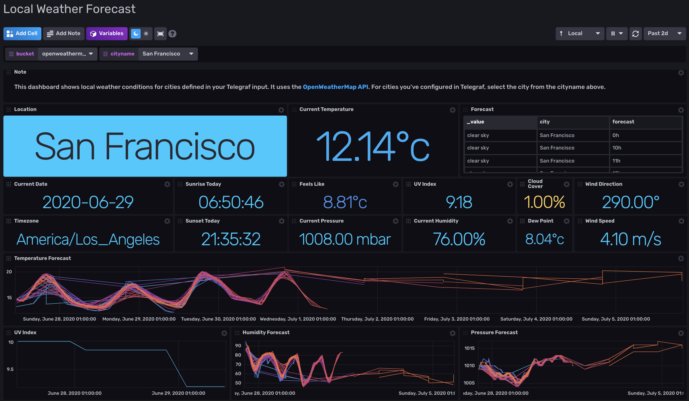

# Local Weather Forecast Template for InfluxDB v2

Provided by: Rick Brown

This Dashboard provides weather reports and forecasts. It gives local information wherever in the world your city is, and regardless of that city's timezone.

> Note that this facility requires Python3 to be available, to run the data collection script.



### Quick Install

If you have your InfluxDB credentials [configured in the CLI](Vhttps://v2.docs.influxdata.com/v2.0/reference/cli/influx/config/), you can install this template with:

```
influx pkg -u https://raw.githubusercontent.com/influxdata/community-templates/master/local_weather_forecast/local_weather_forecast.yml
```

## Included Resources

    - 1 Telegraf Configuration: 'local_weather_forecast'
    - 1 Dashboard
    - 1 Bucket: 'openweathermap'
    - 2 Labels: 'InfluxDB2', 'openweathermap'
    - 2 Checks: 'Frost Warning', 'Too Hot'
    - 4 Notification rules: 'Frozen', 'Chance of Frost', 'Heatwave', 'Toasty Warm'
    - 1 Notification endpoint: 'Sample HTTP Endpoint'
    - 1 Executable: 'onecall.py'

## Setup Instructions

General instructions on using InfluxDB Templates can be found in the [use a template](../docs/use_a_template.md) document.
    
    Telegraf Configuration requires the following environment variables
    - `INFLUX_TOKEN` - The token with the permissions to read Telegraf configs and write data to the `telegraf` bucket. You can just use your master token to get started.
    - `INFLUX_ORG` - The name of your Organization.
    - `INFLUX_HOST` - The address of you InfluxDB
    - `INFLUX_BUCKET` - The name of the Bucket. If you going to use the bucket included, you need to export the variable. Ex: <code>INFLUX_BUCKET=openweathermap</code>
    - `OPENWEATHERMAP_CITY_ID` - the city id of the city from where you want to retrieve weather data
    - `OPENWEATHERMAP_UNITS` - whether you want metric (Celcius), imperial (Fahrenheit) or normal (Kelvin) temperatures
    - `OPENWEATHERMAP_APP_ID` - the API ID you've registered in OpenWeatherMap for this

The INFLUX_* environment variables are discussed elsewhere. In order to use this dashboard you also need OpenWeatherMap environment variables.

You need to get an `OPENWEATHERMAP_APP_ID`:

- https://home.openweathermap.org/api_keys

You will also need an `OPENWEATHERMAP_CITY_ID`:

- http://78.46.48.103/sample/daily_16.json.gz

To determine the correct value for `OPENWEATHERMAP_UNITS` navigate to this URL:

- https://openweathermap.org/api/one-call-api

You will note from that web page that you can also change the language of text returned by appending "lang=" to the API call in the Python script

When you have this data, you need to make the appropriate environment variables as listed above, and execute Telegraf.

If you want to report weather conditions in multiple locations, run a new instance of Telegraf with a different `OPENWEATHERMAP_CITY_ID` but all other settings the same.
Please note that every invocation (default every 30 minutes) of the script makes 2 calls to OpenWeatherMap.
A free account currently supports up to 1000 calls per day before rejecting further API requests.

## Contact

Author: Rick Brown

Email: rbrown[at]influxdata[dot]com
